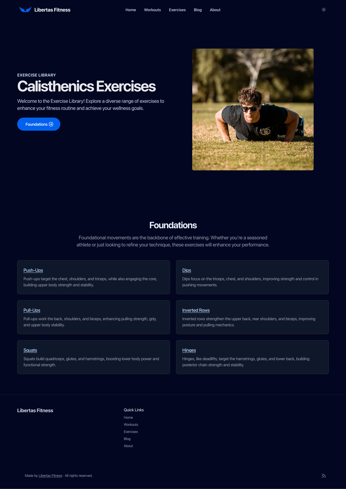

# Fitness Website - Built with Astro.js

## Overview

This is a fitness website I created to experiment with **Astro.js** for my portfolio. The website was built using a pre-made template to help accelerate the development process while I focused on learning how to integrate Astro.js, design some elements using **Figma**, and deploy it to a **real custom domain** using **Vercel**.

## Screenshot

## Features

- Responsive design, optimized for mobile and desktop users.
- Static site generation for fast, optimized performance.
- Clean and user-friendly interface with a focus on fitness-related content.
- Logo and some design elements created with **Figma**.
- Template-based structure for easy modifications and scalability.
- Deployed on a **real custom domain** using **Vercel**, showcasing the site on a live URL.

## Lessons Learned

### 1. **Navigating Templates**
   - I explored how to select and work with pre-made templates, customizing them for my specific needs.
   - Understanding how templates are structured helped me quickly grasp how Astro.js functions, such as components, pages, and layouts.
   - I learned how to incorporate custom elements and tweak styles to match my vision while maintaining the core functionality of the template.

### 2. **Deploying with Vercel**
   - One of the biggest learning points was deploying the site to a **real custom domain** using **Vercel**.
   - I gained hands-on experience with the Vercel platform, from connecting my GitHub repository to setting up domain configurations.
   - Vercel made it easy to deploy and manage updates, which streamlined the process of pushing my site live.

### 3. **Designing with Figma**
   - I used **Figma** to design the logo and some other key visual elements of the site.
   - This helped me understand how to translate design concepts into real, functioning web elements while maintaining consistency and style.

## Technologies Used

- **Astro.js**: A modern framework for building fast, optimized websites with static site generation.
- **HTML/CSS/JavaScript**: Core web technologies for building the frontend.
- **Figma**: Used for designing logos and other visual elements.
- **Vercel**: Hosting platform for seamless deployment.
- **Custom Domain**: Purchased and configured for this project to showcase the site on a live URL.

## Repository Access

The code is **private** as I may potentially use the project for **commercial or proprietary purposes** in the future. I want to retain control over the usage and distribution of the code for now.

If you're interested in viewing the repository or have any questions about the project, feel free to **contact me directly**. I’d be happy to share more information and discuss the project further!

## Links

- **Live Site**: [libertas.fit](https://www.libertas.fit/)
- **GitHub Repository**: https://github.com/MikeBoguszewski/libertas-fitness-public

## Final Thoughts

This project was an excellent opportunity to dive into Astro.js and explore modern front-end frameworks while practicing deployment on a live platform. The template helped me speed up the process, but I also learned valuable lessons about customization and integration. Deploying on a **real custom domain** using **Vercel** gave me practical knowledge of cloud deployment and hosting.

---

